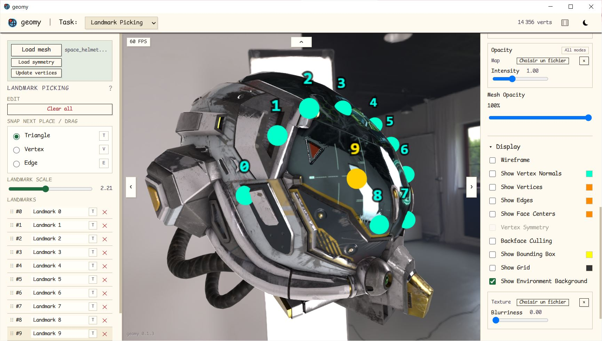

<p align="center">
  
</p>

<h1 align="center">geomy</h1>

<p align="center">
  Cross-platform 3D mesh annotation tool for NumPy workflows
</p>

<p align="center">
  <a href="https://geomy.gker.fr">Open geomy</a>
  ·
  <a href="https://github.com/Kiord/geomy/releases">Desktop downloads</a>
</p>

## About

Geomy provides tools for 3D mesh inspection, annotation, masking, segmentation, and alignment.

The application stays close to the source data. It does not silently weld, simplify, or re-index imported meshes. Vertex order and topology remain stable across inspection and annotation tasks, so exported indices and arrays still match the original mesh.

NPY and NPZ support makes geomy suitable as an interactive step in Python and NumPy workflows.



## Tools

- **3D inspection:** inspect geometry and scene properties, adjust the display, and show vertices, edges, normals, or materials
- **Landmark picking:** place vertex or surface landmarks, including symmetric placement
- **Mesh masking:** paint and manage vertex masks, use morphological operations, and combine masks
- **Mesh segmentation:** assign vertices to named regions and reorder or edit the segmentation
- **Rigid alignment:** align meshes from landmarks or selected regions and export transforms or vertices

## Data and NumPy

Mesh files can be loaded from **OBJ**, **STL**, **PLY**, **GLB**, and **GLTF**. Task data can be imported or exported using formats suited to scripts and notebooks, including **NPY**, **NPZ**, **JSON**, and plain text where applicable.

Depending on the task, geomy can exchange:

- vertex indices and dense boolean masks
- segmentation labels and region masks
- landmark vertex indices or simplex and barycentric coordinates
- transformation matrices and transformed vertex arrays


## Use geomy

### Online

The hosted version is available at [geomy.gker.fr](https://geomy.gker.fr).

### Run from source

You need a recent version of Node.js.

```bash
git clone https://github.com/Kiord/geomy.git
cd geomy
npm install
npm run dev
```

The development server prints the local address to open in your browser.

### Desktop builds

Desktop packages are published on the [GitHub Releases page](https://github.com/Kiord/geomy/releases):

- Windows portable executable and installer
- Linux executable and `.deb` package
- macOS `.dmg` package

The desktop application uses the operating system's native webview. On Windows, WebView2 is included with current versions of Windows and is available separately from Microsoft for older installations. The Linux build requires GTK 3 and WebKitGTK 4.1 from the distribution. *Linux version currently suffers from slow-path WebGL rendering, prefer browser version*.

## Development

Run the unit tests:

```bash
npm test
```

Build the static web application:

```bash
npm run build
```

Run the Tauri desktop application in development mode:

```bash
npm run desktop:dev
npm run desktop:build
```

Building the desktop application requires the platform dependencies listed in the [Tauri prerequisites](https://v2.tauri.app/start/prerequisites/).

## Publishing a release

Update the version, commit it, and push the commit with its tag:

```bash
npm version X.X.X
git push origin HEAD --follow-tags
```

Pushing the version tag starts the GitHub Actions release workflow. It builds the web application and desktop packages, then attaches the generated files to the corresponding GitHub release.

*Development of this project deliberately makes use of AI assistance*
